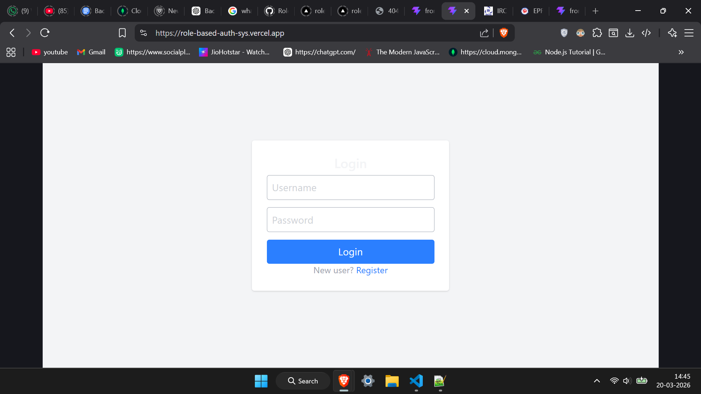
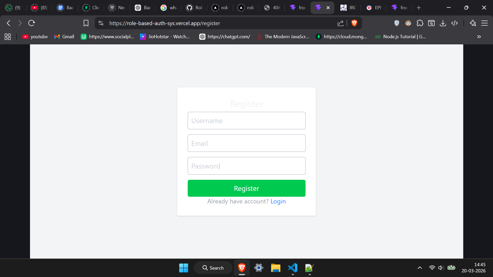
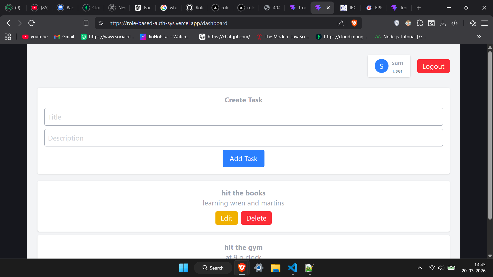

# Role-Based Auth System 🚀

A scalable full-stack web application demonstrating **JWT-based authentication**, **role-based access control**, and **task management (CRUD)** using React.js and Node.js.

---

## 🌐 Live Demo
- **Frontend:** https://role-based-auth-sys.vercel.app  
- **Backend API:** https://rolebasedauthsys-production.up.railway.app/api  

---

## 📸 Screenshots

### 🔐 Login Page


### 📝 Register Page


### 📊 Dashboard


---

## ✨ Features

### 🔧 Backend
- User registration & login
- JWT-based authentication
- Role-based access control (User/Admin)
- Secure password hashing using bcrypt
- CRUD APIs for task management
- Protected routes using middleware
- Error handling & validation

### 💻 Frontend
- Login & Registration UI
- Protected dashboard
- Create, update, delete tasks
- Profile card (username + role)
- API integration with backend
- Styled using Tailwind CSS

---

## 🔐 Security
- Passwords hashed using bcrypt
- JWT token-based authentication
- Protected API routes

---

## 🛠 Tech Stack
- **Frontend:** React.js, Tailwind CSS, Vite  
- **Backend:** Node.js, Express.js  
- **Database:** MongoDB (Mongoose)  
- **Authentication:** JWT  

---

## 🔗 API Endpoints

### 🔑 Auth
- `POST /api/auth/register`
- `POST /api/auth/login`

### 📋 Tasks
- `GET /api/tasks`
- `POST /api/tasks`
- `PUT /api/tasks/:id`
- `DELETE /api/tasks/:id`

### 👤 User
- `GET /api/home/welcome`

---

## ⚙️ Setup Instructions

### 1️⃣ Clone the Repository
```bash
git clone https://github.com/akshaygolange/RoleBasedAuthSys.git
cd RoleBasedAuthSys
```

### Backend setup
```bash
cd backend
npm install
npm run dev
```

### Frontend setup
```bash
cd frontend
npm install
npm run dev
```